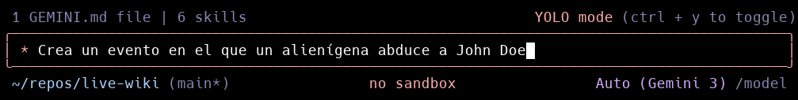

# 🚀 Live-Wiki


> **Una wiki estática "text-first" para documentación de mundos, lore y narrativa.**
> Diseñada para ser inmutable, rápida y sin base de datos.

---

## 🔗 Demo y Recursos (Requisitos TFM)

- 🌐 **Despliegue Real:** [ **VER PROYECTO ONLINE** ](https://live-wiki.pages.dev/es/)
- 📄 **Slides de Presentación:** [ **VER PRESENTACIÓN (PDF)** ](https://github.com/JownyDev/live-wiki/blob/main/docs/tfm/TFM%20Presentation%20-%20Live-Wiki.pdf)
- 🐙 **Repositorio:** [GitHub Público](https://github.com/JownyDev/live-wiki)

---

## 📸 Vista Previa




---

## 📖 Descripción General

**Live-Wiki** es una plataforma de documentación para universos de ficción (juegos, novelas, RPGs) construida sobre la filosofía **Jamstack**.

A diferencia de las wikis tradicionales (MediaWiki), Live-Wiki **no usa base de datos**. Todo el contenido reside en archivos Markdown dentro del repositorio, permitiendo:

1.  **Versionado real:** Historial de cambios mediante Git.
2.  **Colaboración:** Pull Requests para proponer cambios en el lore.
3.  **Calidad automática:** Un linter personalizado valida la coherencia de la historia (fechas, referencias rotas, IDs duplicados) en cada commit.

---

## 🛠️ Stack Tecnológico

Este proyecto utiliza un stack moderno enfocado en rendimiento y DX (Developer Experience):

- **Core:**  
- **Estilos:** 
- **Testing & Calidad:**   
- **Infraestructura:**  

---

## 🚀 Guía de Inicio: ¿Cómo quieres usar esto?

Existen dos formas principales de utilizar Live-Wiki. Elige la que se adapte a tu objetivo:

### Opción A: Autor de Lore / Uso Personal (Fork)

_Ideal si quieres documentar tu propia novela, campaña de RPG o videojuego usando esta herramienta como base._

1.  **Haz un Fork** de este repositorio a tu cuenta de GitHub.
2.  Clona **tu** repositorio:
    ```bash
    git clone https://github.com/TU-USUARIO/live-wiki.git
    cd live-wiki
    ```
3.  Instala las dependencias:
    ```bash
    pnpm install
    ```
4.  **Limpia el ejemplo:** Elimina los archivos `.md` dentro de `content/` para empezar tu universo desde cero (manteniendo la estructura de carpetas).
5.  **Personaliza:** Puedes modificar colores, componentes o añadir nuevos tipos de entidad según las necesidades específicas de tu mundo.

### Opción B: Contribuidor del Core

_Ideal si quieres mejorar el motor, añadir componentes reutilizables, corregir bugs o expandir el sistema base para la comunidad._

1.  Clona el repositorio original:
    ```bash
    git clone https://github.com/JownyDev/live-wiki.git
    ```
2.  Instala y levanta el entorno:
    ```bash
    pnpm install && pnpm dev
    ```
3.  **Reglas de Ingeniería:** Consulta [AGENTS.md](./AGENTS.md) antes de tocar código lógico o estructural.

### Opción C: Core público + Lore privado (recomendado para IA)

_Ideal si quieres publicar el motor pero mantener mundos privados en repos separados._

1. Crea una carpeta de trabajo local llamada `live-wiki-workspace`.
2. Dentro, usa esta estructura:
   ```text
   live-wiki-workspace/
   ├── code/   # este repo (público)
   └── lore/   # repo privado con uno o más proyectos
   ```
3. Define la variable `LORE_CONTENT_DIR` apuntando al proyecto de lore activo.

   Ejemplo:

   ```bash
   export LORE_CONTENT_DIR=../lore/project-a/content
   pnpm dev
   ```

Con esto puedes trabajar código + lore a la vez en local, sin publicar contenido privado.

---

## 💻 Comandos Globales

Independientemente de tu modo de uso, estos son los comandos que usarás día a día:

| Comando           | Descripción                                                      |
| :---------------- | :--------------------------------------------------------------- |
| `pnpm dev`        | Inicia el servidor de desarrollo local.                          |
| `pnpm build`      | Construye el sitio estático para producción.                     |
| `pnpm quality`    | **CI Local:** Ejecuta lint, typecheck y tests unitarios.         |
| `pnpm test:e2e`   | Ejecuta los tests end-to-end con Playwright.                     |
| `pnpm wiki:new`   | Crea una nueva entidad (ej: `pnpm wiki:new character gannicus`). |
| `pnpm wiki:check` | **Lore Linter:** Valida la integridad de tu historia.            |

### Variable opcional: `LORE_CONTENT_DIR`

Si está definida, el sitio y el CLI leerán/escribirán lore desde esa ruta en lugar de `./content`.

```bash
# Ejemplo: lore privado fuera del repo público
export LORE_CONTENT_DIR=../lore/project-a/content
pnpm wiki:check
pnpm dev
```

---

## 🧩 Funcionalidades Clave

### 1. Sistema de Entidades

Soporte nativo para 7 tipos de contenido con esquemas estrictos:

- `character`, `event`, `place`, `planet`, `element`, `card`, `mechanic`.

### 2. Lore Linter (Motor propio)

Un paquete desarrollado a medida (`packages/lore-linter`) que impide "romper" la historia:

- Detecta referencias a personajes que no existen.
- Valida cronologías (un evento no puede ocurrir antes de nacer sus participantes).
- Asegura IDs únicos en todo el universo.

### 3. Relaciones Automáticas

El sistema cruza los datos del frontmatter para generar automáticamente:

- "Aparece en..." (Backlinks).
- Líneas de tiempo de personajes.

### 4. Seguridad

- Renderizado estático (sin servidor runtime).
- Sanitización estricta de HTML para prevenir XSS.

---

## 📂 Estructura del Proyecto

```text
├── content/              # Fuente de la verdad (Markdown)
│   ├── characters/       # Personajes y sus perfiles de IA
│   ├── events/           # Eventos cronológicos
│   └── ...               # (planets, places, elements, mechanics, cards)
├── docs/                 # Documentación de diseño (ADRs), TFM y API
├── packages/
│   ├── lore-linter/      # Motor de validación (Reglas de consistencia narrativa)
│   └── wiki-cli/         # Herramientas dev (pnpm wiki:new, pnpm wiki:check)
├── skills/               # Habilidades especializadas para agentes IA
├── src/                  # Código fuente Astro
│   ├── components/       # Componentes visuales (Astro Islands)
│   ├── layouts/          # Estructuras de página compartidas
│   └── pages/            # Rutas y carga de datos
├── templates/            # Plantillas base para nuevas entidades
├── tests/                # Tests E2E (Playwright)
└── .github/workflows/    # CI/CD Pipelines
```

---

## 🤝 Contribución y Reglas del Proyecto

Este proyecto sigue reglas estrictas para mantener la calidad tanto del código como del lore. Si deseas contribuir, consulta las siguientes guías:

- **[AGENTS.md](./AGENTS.md):** Reglas técnicas, stack asumido y flujos de trabajo (TDD, Clean Code).
- **[AGENTS-LORE.md](./AGENTS-LORE.md):** Guía de estilo y convenciones para la escritura del lore.
- **[Design Docs](./docs/design/):** Documentos de arquitectura y decisiones de diseño (ADRs).

---

## 🛠️ Flujo de Trabajo (Dev & IA)

### 1. Creación de Contenido

Usa el CLI para generar nuevas entidades basadas en plantillas:

```bash
pnpm wiki:new character mi-personaje
```

### 2. Validación de Consistencia

Antes de cada commit, el **Lore Linter** asegura que no existan contradicciones:

```bash
pnpm wiki:check
```

### 3. Automatización con Skills

Si usas un asistente compatible (como Gemini CLI), puedes activar "skills" para automatizar tareas complejas:

- `activate_skill content-creator`: Guía paso a paso para crear lore coherente.
- `activate_skill entity-type-creator`: Ayuda a extender el sistema con nuevos tipos de datos.

---

## 🤖 Desarrollo Asistido por IA

El proyecto está preparado para el desarrollo asistido por IA (Copilot, Cursor, etc).
Para inyectar el contexto del proyecto y las "skills" disponibles:

```bash
bash skills/setup.sh
```

---

## 🚀 Despliegue (CI/CD)

El proyecto cuenta con un pipeline de **Integración Continua** robusto en GitHub Actions:

1.  **Push a rama:** Ejecuta Linter + Typecheck + Unit Tests + Lore Check.
2.  **Pull Request:** Ejecuta todo lo anterior + **Tests E2E con Playwright**.
3.  **Merge a Main:** Si todos los tests pasan, Cloudflare Pages construye y despliega automáticamente la nueva versión.
